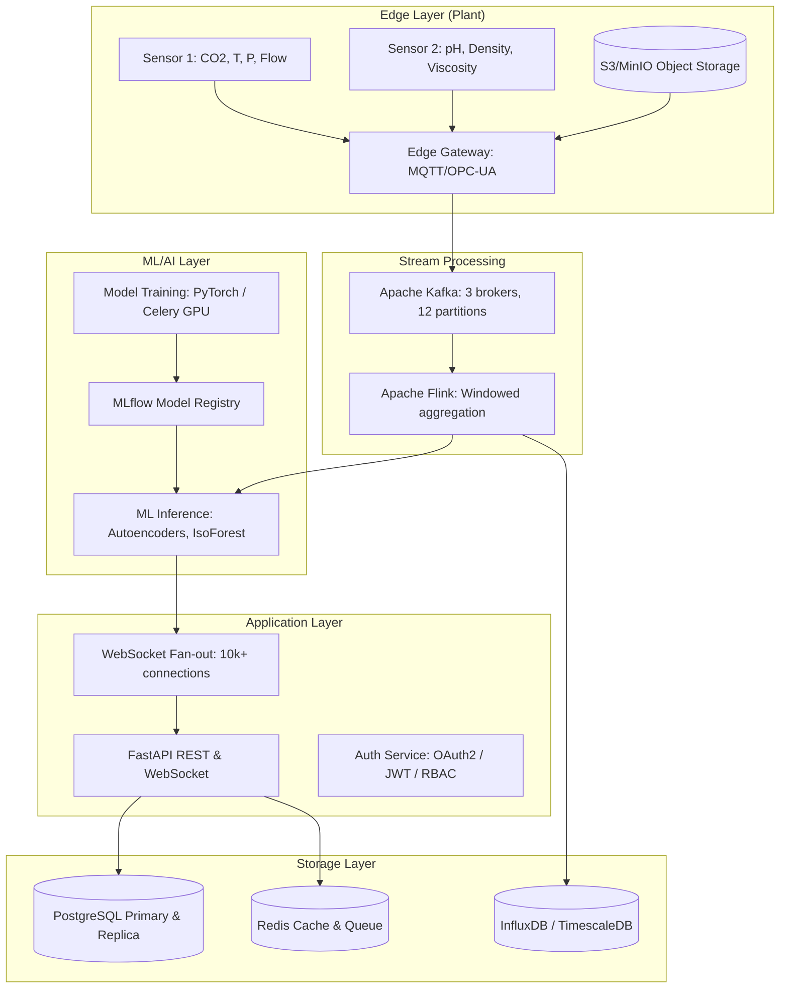

# Carbonize Reference Architecture — Production Deployment

## Architecture Overview

## Hardware Sizing Matrix

| Plant Size | Capacity | vCPUs | RAM | GPU | Storage | Network |
|---|---|---|---|---|---|---|
| Small | <100k t/yr | 8 | 32 GB | 1x T4 | 1 TB | 1 Gbps |
| Medium | 100k-1M t/yr | 32 | 128 GB | 4x A100 | 10 TB | 10 Gbps |
| Large | >1M t/yr | 128 | 512 GB | 16x A100 | 100 TB | 25 Gbps |

## Cloud Costs (Monthly)

| Tier | AWS | GCP | Azure |
|---|---|---|---|
| Small | $1,200 | $1,100 | $1,300 |
| Medium | $8,500 | $8,200 | $8,800 |
| Large | $42,000 | $40,000 | $44,000 |
