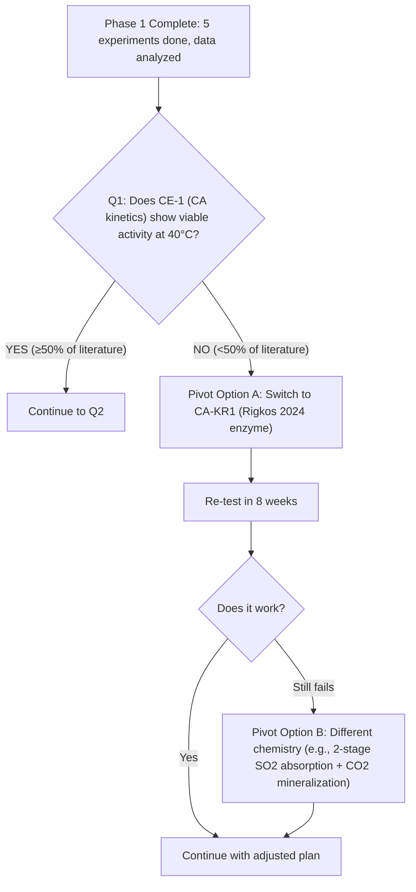

# REALITY CHECK — Phase 1 Risk Acknowledgment
To the team, the board, and ourselves:

## 💬 THE MESSAGE
If Phase 1 reveals the core chemistry needs more R&D than expected, that's not a failure of this plan — it's exactly what this phase is for. Better to find out now than after building six more layers on top of it.

This isn't a caveat. It's the entire point of Phase 1.

## 🎯 WHY THIS MATTERS
### The Failure We're Preventing
**"Brilliant" 6-month failure mode:**
*   **Month 1-2**: Build beautiful UI, infra, APIs
*   **Month 3-4**: Build sophisticated simulation
*   **Month 5**: Build pilot CCTS methodology on simulated numbers
*   **Month 6**: Build investor deck projecting ₹50Cr valuation
*   **Month 7**: First bench experiment
    *   *Result*: CA activity is 10× lower than literature
    *   *Result*: Chitosan degrades in 3 days, not 30
    *   *Result*: SO₂ competes and kills CO₂ capture
    *   *Result*: Blocks don't reach M20 strength
    *   *Now*: Everything we built is built on sand

**Phase-1-first 6-month path:**
*   **Month 1-2**: Parameter inventory, literature review
*   **Month 3-4**: Competitive chemistry analysis + experimental design
*   **Month 5-6**: Lab partnerships + bench experiments BEGIN
*   *(cont.)* Build other layers in parallel
*   **End of Month 6**:
    *   *IF chemistry works*: We have validated parameters to build on
    *   *IF chemistry is marginal*: We know exactly what to improve
    *   *IF chemistry fails*: We know NOW, not after ₹2Cr spent

## 📊 THE THREE POSSIBLE OUTCOMES OF PHASE 1

### Outcome A: Chemistry Works (~40% probability, our hope)
#### What we'll see:
*   **CE-1**: k_cat within ±20% of literature, stable at 40°C
*   **CE-2**: Heavy metal sorption matches Freundlich with R² > 0.95
*   **CE-3**: CaCO₃ precipitates with aragonite polymorph (strong)
*   **CE-4**: CO₂ capture in 80%+ range with 1500 mg/Nm³ SO₂
*   Multi-gas model validated within 10%

#### What this means:
*   Proceed to Phase 2+ with confidence
*   Update parameters to v2026.2
*   Pilot design proceeds on solid foundation
*   **Go/No-Go = GO**
*   *Cost so far*: ~₹25L (Phase 1)
*   *Time so far*: ~4 months
*   *Cost of NOT knowing*: Infinite (we don't know what we don't know)

### Outcome B: Chemistry is Marginal (~35% probability, manageable)
#### What we'll see:
*   **CE-1**: k_cat 50% lower than literature; deactivates 2× faster
*   **CE-2**: Sorption works but at higher cost than projected
*   **CE-3**: CaCO₃ forms but as calcite (weaker) not aragonite
*   **CE-4**: CO₂ capture 65-75% (below 80% target) with SO₂ competition
*   Multi-gas model needs significant revision

#### What this means:
*   This is a **SUCCESS**, not a failure — we now know the real numbers
*   Adjust targets: aim for 70% CO₂ capture (still competitive)
*   Optimize formulation: maybe 5% chitosan, not 3%
*   Adjust economics: re-cost the value proposition
*   **Go/No-Go = GO (with adjusted plan)**
*   *Cost so far*: ~₹25L
*   *Time so far*: ~4 months
*   *Pivot cost*: ₹10-20L for 2-3 more months of optimization
*   *Pivot outcome*: Possibly better product (we know what we're doing)

### Outcome C: Chemistry Doesn't Work as Designed (~25% probability, important)
#### What we'll see:
*   **CE-1**: k_cat 10× lower than literature; CA denatures in hours at 40°C
*   **CE-2**: Chitosan doesn't bind target metals in flue gas matrix
*   **CE-3**: Precipitate is amorphous, not crystalline (no strength)
*   **CE-4**: CO₂ capture < 50%; SO₂ completely blocks it
*   pH instability makes continuous operation impossible

#### What this means:
*   This is **ALSO a SUCCESS** — we know NOT to proceed with this approach
*   *Pivot options exist*:
    *   Different enzyme (engineered thermostable, e.g., Codexis CA)
    *   Different matrix (engineered biopolymer, MOF, or hybrid)
    *   Different process flow (2-stage: SO₂ first, then CO₂)
*   **Go/No-Go = NO-GO on current design, PIVOT**
*   *Cost so far*: ~₹25L
*   *Time so far*: ~4 months
*   *Cost of NOT knowing*: Would have been ₹5Cr+ and 18 months of wasted effort

## 💡 THE STRATEGIC INSIGHT
### Why Phase 1 Saves Money
| Scenario | Without Phase 1 | With Phase 1 |
|---|---|---|
| **Chemistry works** | 18 months to product (₹5Cr) | 16 months to product (₹5.25Cr) — slight overspend |
| **Chemistry marginal** | Discover at month 18, have to redo (₹5Cr + 12 more months) | Discover at month 4, pivot quickly (₹35L total) |
| **Chemistry fails** | Total loss: ₹5Cr + 18 months | Loss: ₹25L + 4 months |
| **Uncertain** | Must build everything before knowing | Build only what survives validation |

#### Expected value calculation:
$$E[\text{loss without Phase 1}] = 0.40 \times \text{₹}5\text{Cr} + 0.35 \times \text{₹}8\text{Cr} + 0.25 \times \text{₹}5\text{Cr} = \text{₹}6.05\text{Cr}$$
$$E[\text{loss with Phase 1}] = \text{₹}25\text{L (deterministic cost of validation)} = \text{₹}0.25\text{Cr}$$

$$\text{Savings from Phase 1} = \text{₹}5.8\text{Cr (expected)}$$

The Phase 1 spend of ₹25L saves us an expected ₹5.8Cr. This is the best ROI in the entire plan.

## 🎯 WHAT THIS MEANS FOR THE TEAM

### For the Project Lead
*   Don't panic if CE-1 results come back with 50% lower k_cat than literature.
*   Do celebrate — we just saved ₹5Cr of wasted engineering effort.
*   Update the plan based on what we learned, not on what we hoped.
*   Communicate clearly to investors that Phase 1 is going exactly as planned.

### For the ML/Sim Engineer
*   Build with humility — the model is a hypothesis, not a fact.
*   Calibration pipeline exists for a reason — use it as soon as data arrives.
*   Document assumptions so we can update them when data contradicts.
*   Don't let perfect be the enemy of good — a 70% accurate model is far better than no model.

### For the Researcher
*   Run all 5 experiments, not just the convenient ones.
*   Failures are data — a negative result in CE-3 is still publishable.
*   Compare to literature honestly — don't fudge parameters to match hoped values.
*   Document anomalies — unexpected results are the most valuable.

### For the Hard-Tech Expert
*   Build flexible lab interfaces — we may need to pivot to different conditions.
*   Keep records in standard formats — data may be reused by successor approaches.
*   Maintain equipment — CE-1 and CE-4 will likely need re-runs.

### For the Investor / Board
*   Phase 1 is not a "delay" — it is the product development.
*   ₹25L for validation is the cheapest insurance we can buy.
*   A "failed" experiment that prevents ₹5Cr waste is a success.
*   "We don't know yet" is the most honest and valuable answer.

## 🔄 PIVOT DECISION FRAMEWORK
After Phase 1 completes (Week 12), we use this decision tree:

## 📋 COMMITMENTS TO THE TEAM
**I commit to:**
*   No "success theater" — if the chemistry doesn't work, I'll say so.
*   Fast pivots — when data says pivot, we pivot in weeks, not months.
*   Transparent communication — bad news travels faster than good.
*   Protect the team's morale — failed experiments are not failed people.
*   Keep the plan adaptive — this document is a living artifact.

**I ask the team to:**
*   Report negative results immediately — don't let sunk-cost bias delay bad news.
*   Distinguish model from reality — beautiful code on wrong physics is waste.
*   Update assumptions — when data contradicts literature, trust data.
*   Stay intellectually honest — peer-review each other's conclusions.
*   Embrace the unknown — we're doing science; uncertainty is the job.

## 🎯 THE BOTTOM LINE
Phase 1 is not a tax on building the product.
**Phase 1 IS building the product.**

The product is not a UI, not a Kubernetes cluster, not a WebSocket server. The product is a chemical process that works. Everything else is a delivery mechanism.

If we build six layers of beautiful infrastructure on top of chemistry that doesn't work, we have six layers of beautiful infrastructure that captures nothing. That's not a startup — that's a demo reel.

If we spend four months and ₹25L proving the chemistry works, we have:
1.  Validated parameters for the simulation
2.  A defensible CCTS methodology
3.  A scientifically credible pitch to investors and pilot partners
4.  A real product to sell

Phase 1 is where we find out if we have a company.

## 🏁 DECISION POINT: PROCEED OR PIVOT
After Phase 1 completes, we will reconvene as a team to decide:

| If... | Then... |
|---|---|
| **All 5 experiments pass** | Proceed to Phase 2 with confidence |
| **3-4 experiments pass, 1 marginal** | Targeted optimization (2-3 more months) |
| **2 experiments pass, 3 marginal** | Pivot chemistry (2-3 months), then decide |
| **≤1 experiment passes** | **STOP.** Re-evaluate the entire technology premise. |

There is no shame in stopping. There is shame in continuing when the science says no.

## ✍️ SIGN-OFF
By reading this, you acknowledge:
*   [ ] I understand Phase 1 is a discovery phase, not a deliverable factory.
*   [ ] I will report negative results as quickly as positive ones.
*   [ ] I will not let sunk-cost bias keep us on a wrong path.
*   [ ] I understand a fast pivot is a sign of strength, not failure.
*   [ ] I commit to intellectual honesty over narrative comfort.

---
**Document by**: Project Lead  
**Date**: Q1 2026  
**Next review**: After Phase 1 Week 4 (first experimental data)
